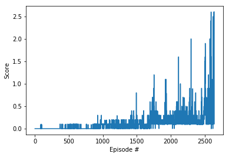
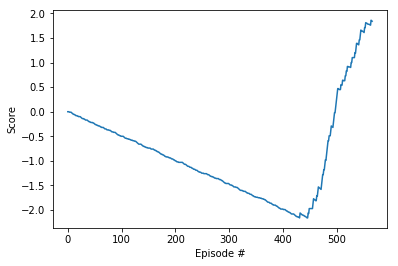

# DRLND - Collaboration and Competition
## Third project in the Deep Reinforcement Learning Nanodegree.

The report at hand shall provide an overview of the applied algorithms as well as opportunities to further evolve the agent and the neural network behind.

# Learning Algorithm

To solve this environment I tested two apporaches.

## DDPG (Single Agent)
At first I reused my Deep Deterministic Policy Gradients (DDPG) implementation from project three. On top of the regular DDPG I realized the model as a Duelling Network. I had to recognize, that this version was hardly learning at all. After removing the Duelling end of the network as well as the normalization methods the DDPG solved the environment after 2539 episodes. 



The following hyper parameters are used:

```
BUFFER_SIZE = int(1e5)  # replay buffer size
BATCH_SIZE = 64         # minibatch size
GAMMA = 0.97            # discount factor
TAU = 1e-3              # for soft update of target parameters
LR_ACTOR = 1e-3         # learning rate of the actor
LR_CRITIC = 1e-3        # learning rate of the critic 2539
WEIGHT_DECAY = 0        # L2 weight decay
```
The Network Structure is the same as in the second more successful apporach and is shown down below. It was interessting for me to see that I had to reduce nodes and choose to have more nodes in the second hidden layer as in hidden layer one.
<br>

## MADDPG (Mutiple Agents)
To see if this result can be improved I realized a MADDPG as well. The MADDPG Agent is organizing (in this case two) independet agents with their own Replay Buffer. The Main functions `m_act(self, states, noise)`  and `m_step(self, time_step, states, actions, rewards, next_states, dones)` call the respective DDPG Agent functions with their environment subset (see below):
```
class MADDPG:
    def __init__(self, num_agents, state_size, action_size, random_seed):
        super(MADDPG, self).__init__()

        self.state_size = state_size
        self.action_size = action_size
        self.num_agents = num_agents
        self.seed = random.seed(random_seed)

        self.discount_factor = GAMMA
        self.tau = TAU
        self.iter = 0

        self.maddpg_agents = [Agent(state_size, action_size, random_seed) for i in range(num_agents)]


    def get_Agent(self, agent):
        return self.maddpg_agents[agent]


    def m_act(self, states, noise):
        actions = np.array([self.maddpg_agents[i].act(states[i],noise) for i in range(self.num_agents)])
        return actions


    def m_step(self, time_step, states, actions, rewards, next_states, dones):
        """Save experience in replay memory, and use random sample from buffer to learn."""

        # DDPG Agent step
        for i in range (self.num_agents):
            self.maddpg_agents[i].step(time_step, states[i], actions[i], rewards[i], next_states[i], dones[i])


    def reset(self):
        for i in range (self.num_agents):
            # DDPG Agent reset
            self.maddpg_agents[i].reset()
```

The Hyperparameter used are again: 
```
BUFFER_SIZE = int(1e5)  # replay buffer size
BATCH_SIZE = 64         # minibatch size
GAMMA = 0.97            # discount factor
TAU = 1e-3              # for soft update of target parameters
LR_ACTOR = 1e-3         # learning rate of the actor
LR_CRITIC = 1e-3        # learning rate of the critic 2539
WEIGHT_DECAY = 0        # L2 weight decay
TIME_STEPS = 3          # Learn only each 3 time steps
```

## Network Structures
The Network structure for both approaches are identical and very similar to the course implementation for DDPG

### Actor (Policy) Model
Network that maps state -> action values. Forward propagation.

```  
class Actor_QNetwork(nn.Module):
    """Actor (Policy) Model. DuelingQNetwork"""

    def __init__(self, state_size, action_size, seed, fc1_units=100, fc2_units=200,  init_weights=3e-3):
        """Initialize parameters and build model.
        Normalization of Layers improves network perofmance significantly.
        Params
        ======
            state_size (int): Dimension of each state
            action_size (int): Dimension of each action
            seed (int): Random seed
            fc1_units (int): Number of nodes in first hidden layer
            fc2_units (int): Number of nodes in second hidden layer
        """
        super(Actor_QNetwork, self).__init__()
        # Random seed
        self.state_size = state_size
        self.action_size = action_size
        self.seed = torch.manual_seed(seed)

        # Input layer
        self.fc1 = nn.Linear(state_size, fc1_units)

        # create hidden layers according to HIDDEN_SIZES
        self.fc2 = nn.Linear(fc1_units, fc2_units)
        self.fc3 = nn.Linear(fc2_units, action_size)

        self.reset_parameters(init_weights)

        # Initialize Parameter
    def reset_parameters(self, init_weights):
        self.fc1.weight.data.uniform_(*hidden_init(self.fc1))
        self.fc2.weight.data.uniform_(*hidden_init(self.fc2))
        self.fc3.weight.data.uniform_(-init_weights, init_weights)


    def forward(self, state):
        """Build a network that maps state -> action values. Forward propagation"""

         # classical network with relu activation function
        x = F.relu(self.fc1(state))
        x = F.relu(self.fc2(x))
        x = self.fc3(x)

        return F.tanh(x)
```

### Critic (value) Network
Simple network with two hidden layers that maps (state, action) pairs -> Q-values.

```
class Critic_QNetwork(nn.Module):
    """Critic (Value) Model."""

    def __init__(self, state_size, action_size, seed, fc1_units=100, fc2_units=200, init_weights=3e-3):
        """Initialize parameters and build model.
        Params
        ======
            state_size (int): Dimension of each state
            action_size (int): Dimension of each action
            seed (int): Random seed
            fcs1_units (int): Number of nodes in the first hidden layer
            fc2_units (int): Number of nodes in the second hidden layer
        """
        super(Critic_QNetwork, self).__init__()

        self.seed = torch.manual_seed(seed)

        # Input Layer
        self.fc1 = nn.Linear(state_size, fc1_units)

        # Hidden Layer
        self.fc2 = nn.Linear(fc1_units+action_size, fc2_units)
        self.fc3 = nn.Linear(fc2_units, 1)
        self.reset_parameters(init_weights)

        # Initialize Parameter
    def reset_parameters(self, init_weights):
        self.fc1.weight.data.uniform_(*hidden_init(self.fc1))
        self.fc2.weight.data.uniform_(*hidden_init(self.fc2))
        self.fc3.weight.data.uniform_(-init_weights, init_weights)

    def forward(self, state, action):
        """Build a critic (value) network that maps (state, action) pairs -> Q-values."""
        xs = F.relu(self.fc1(state))
        x = torch.cat((xs, action), dim=1)
        x = F.relu(self.fc2(x))
        return self.fc3(x)
```

# Plot of Rewards for MADDPG Solution
A plot of reward is calculated every time you train the agent using `MADDPG_Tennis_467.ipynb`.
<br>
With the parameter set given above the MADDPG Agent solved the environment after 467 episodes.

<br>
The corresponding model weights for both Agents and there respective Actor and Critic Networks are provided in the `MADDPG_Weights_467` folder.

It is obvious that the MADDPG Agent solution is far more succesful as the single DDPG approach, although it is interessting to see, that performance within the first 300 episodes is even negative. But starting around episode 400 the gradient of the curve is almost vertical. The DDPG really started learning after 1000 episodes but with a much smaller gradient which also had a significant increase at the end (around episode 2400).

# Ideas for Future Work
In this project I concentrated on implementing the MADDPG approach with seperated Replay Buffer but still there are plenty of opportunities to simply improve the performance parameters. A shared Replay Buffer will certainly provide different results but also other Policy Gradient based algorithms (PPO etc.) maybe more succesful or even a more elabored DQN. A combination could also be possible.

Evaluating more variations of Hyperparameter may also increase performance. As stated above, I initially experimented with a bigger network und buffer. These versions were hardly learning at all.

2018-12-05


